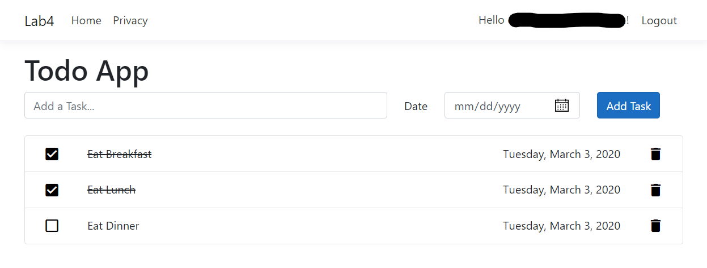

# Lab 4B - .NET Core MVC Part 2

## Overview

In our last lab, we laid the foundations for a Todo Application that uses a NoSQL database that's hosted in the cloud to store tasks. In this lab, we will continue what we started, and re-create our Todo Application once more, this time using the full MVC Framework provided by Microsoft .Net Core.



### Functionality

- Create, Read, Update, and Delete tasks using C# MVC from a single page

### Concepts

- MVC (Model, View, Controller)
- Asynchronous Programming (`Task`, `await`)
- Scaffolding

### Resources

- [Role-based authorization in ASP.NET Core](https://docs.microsoft.com/en-us/aspnet/core/security/authorization/roles?view=aspnetcore-3.1#adding-role-checks)
- [Handle requests with controllers in ASP.NET Core MVC](https://docs.microsoft.com/en-us/aspnet/core/mvc/controllers/actions?view=aspnetcore-3.1)
- [Routing to controller actions in ASP.NET Core](https://docs.microsoft.com/en-us/aspnet/core/mvc/controllers/routing?view=aspnetcore-3.1)
- [Controller methods and views in ASP.NET Core](https://docs.microsoft.com/en-us/aspnet/core/tutorials/first-mvc-app/controller-methods-views?view=aspnetcore-3.1)
- [Views in ASP.NET Core MVC](https://docs.microsoft.com/en-us/aspnet/core/mvc/views/overview?view=aspnetcore-3.1)
- [Publish an ASP.NET Core app to Azure with Visual Studio](https://docs.microsoft.com/en-us/aspnet/core/tutorials/publish-to-azure-webapp-using-vs?view=aspnetcore-3.1)
- [MongoDB.Driver Reference - Reading](https://mongodb.github.io/mongo-csharp-driver/2.10/reference/driver/crud/reading/)
- [MongoDB.Driver Reference - Writing](https://mongodb.github.io/mongo-csharp-driver/2.10/reference/driver/crud/writing/)

### Assignments

Lab Writeup Instructions are in the "Content" tab in [Learning Suite](http://learningsuite.byu.edu).

# Instructions

## Step 1 : Add a Controller

Now that we have our new model, we can create a Controller for it. Controllers define Actions (functions) that are associated with Views (.cshtml files).

### Scaffold the Controller

1. Right-click on the `Controllers` folder and select `Add > New Scaffolded Item`

    - Select `MVC Controller with views, using Entity Framework`
    - Click <kbd>Add</kbd>
    - In the `Model class` dropdown, select your `_Task` model that you created last lab
    - For the `Data context class`, select `ApplicationDbContext`
    - Leave the default `Controller name`, and click <kbd>Add</kbd>
 
    > Note: If you look at your newly-scaffolded file, you'll notice it's very built-out. There are plenty of comments explaining important things. You'll also notice your basic CRUD operations already made for you! This is the power of using real IDEs in the workforce. Much of the code you'll need to write has most likely already been written for you, you just need to know how to implement it!
    >
    > You'll see comments such as `// POST: _Task/Edit/5`. These are URLs that you'll use to execute your CRUD operations. The `5` just means that's where you need to put the `Id` of that particular task, so it knows which task to edit. They are using the task with `Id = 5` as an example.

2. Protect your `_TaskController` from unauthorized access the same way you protected the `HomeController`

### Edit the Controller

In this section, we will be making quite a few edits to the controller in order to have it use our `MongoDbContext` instead of `ApplicationDbContext`.

1. Replace the private `ApplicationDbContext _context` variable and replace it with a private readonly property called `_dao` that's of type `ITaskDao`.
    - Instead of setting the variable all plain and simple, set it with the `TaskDao` constructor and the `new` keyword inside the `_TaskController` constructor.
2. Change the constructor of the controller to accept only one parameter: a `settings` parameter of type `IAtlasSettings`.
3. Delete the following actions:
    - Details (`GET: _Task/Details/5`)
    - The first Create (`GET: _Task/Create`)
    - The first Edit (`GET: _Task/Edit/5`)
    - The first Delete(`GET: _Task/Delete/5`)
    - The `TaskExists()` action
4. Update the `Index()` action in the following ways:
    - Find the current user's `Id`
      - [This Stack-Overflow question might help with this](https://stackoverflow.com/questions/30701006/how-to-get-the-current-logged-in-user-id-in-asp-net-core)
    - Send the current user's `Id` to the view useing the `ViewData` object 
    - Retrieve the list of tasks assigned to the current user from `_dao`
    - Send the list of tasks to the view using the `ViewData` object
    - Remove all parameters when calling the `View()` method
    > Note: `ViewData` is a dictionary (key-value pair data structure) that is shared between the controller and the view (much like the `$_SESSION` super-global array in PHP)
5. Update the `Create()` action in the following ways:
    - Change the parameter to only bind the following columns: `"UserId,Text,Date"`
    - Use the `_dao` object to create the task instead of the `_context` object
6. Update the `Edit()` action in the following ways:
    - Flip the value of the `Done` attribute of `task`
    - Use `_dao` to update the task instead of `_context`
    - Replace the entire body of the `catch` block with `return NotFound();`
7. Update the `DeleteConfirmed()` action in the following ways:
    - Use `_dao` to delete the task instead of `_context`

## Step 2 : Edit the View

If you look in your `Views` folder, you can see that there are 5 new pages that were created inside of a new `_Task` folder. Right now, there's no way to see those pages, and for our purposes, we aren't going to need them all. It's worth exploring though, because they generate forms for you to do all of the CRUD functions. Our system works a bit differently, because we want all of those functions to be available from a single page, so we will only use these files for reference except for the `Index.cshtml` file which we will change.

Before doing anything, we'll want to change our default controller to the _Task controller, which means when logged in, we will see the Index in the `_Task` folder instead of the `Home` folder.

1. In `Startup.cs`, Change the default controller to `_Task` instead of `Home`
2. Open `Views/Shared/_Layout.cshtml` and change any links associated with the `Home` controller to be associated with the `_Task` controller instead

### Read

1. Open `Views/_Task/Index.cshtml` and explore the table that was scaffolded for this page
2. Get rid of any reference to the `Details` action (like the links to it)
3. At the top, change the import of the `@model` to be just the `_Task` class, instead of an enumerable (array) of `_Task` objects
4. Add some C# code at the top to grab the list of tasks from the `ViewData` object and set it to a variable of type `IEnumerable<_Task>` so you can use it in a for loop to list all of the current tasks. To do this you will have to re-cast the list output of ViewData to type `IEnumerable<_Task>`.

    > Hint: Any time you want to use C# in the view, you can do so with the `@` symbol. If you want to add multiple lines, you can do so using the following syntax:
    > ```cs
    > @ {
    >     // some C# code
    > }
    > ```

5. Change the table so it only shows 4 columns in the following order:
    - The `Done` column,
    - The `Text` column,
    - The `Date` column,
    - And a new column for the delete button
6. Add a `@foreach` loop that loops through the list of tasks you sent through the `ViewData` object and adds a `<tr>` (table row) element for each task

### Create

1. Open `Views/_Task/Create.cshtml` and explore the form that was scaffolded for this page
2. Open `Views/_Task/Index.cshtml` and replace the `<p>` tag with the link in it with a form above the table and associate it with the `Create()` action of `_TaskController`
    - It must include an input for each column in the `Bind` statement of the `task` parameter of the `Create()` action
    - The input for `UserId` should be hidden, and therefore have the value already set using the HTML `value=""` attribute

> Hint: Use the form in `Views/_Task/Create.cshtml` to figure out how they were able to hook up the form to the controller, then just copy that! But make sure to leave out fields that shouldn't be there, i.e. `Id` and `Done`

> Hint 2: Make sure that the `UserId` field is hidden

### Update

1. Open `Views/_Task/Edit.cshtml` to see how to submit changes to a task
2. Make the following changes to `Views/_Task/Index.cshtml`:
    - Add a `<form>` and a `<button>` tag surrounding the checkbox's box in the table
    - Give the form an `asp-action` attribute and point it to the proper action in the `_TaskController`
        > Note: The button will look ugly. You can give it a class and add some CSS to the `wwwroot/css/site.css` file to make it less ugly
    - Make sure there is an input for each column in the `Bind` statement of the `task` parameter of the `Edit()` action
    - Be sure to include the `asp-for` attribute on each `<input>` tag

### Delete

1. Open `Views/_Task/Delete.cshtml` to see how to delete a task
2. Make the following changes to `Views/_Task/Index.cshtml`:
    - Add a `<form>` tag to the last column in the html found in the `@foreach` loop to add it to every row
    - Add an `asp-action` attribute and point it to the proper action on the `_TaskController`
    - The form should only have 2 inputs: One hidden one who's value is the task's Id, and one of type "submit"

## Step 3 : Publish your site to Azure

This part is a bit of a doozy, so please, read __ALL__ of the instructions, __EXTREMELY__ carefully.

1. Test your app thoroughly. Ensure that the following functions work:
    - Register new users
    - Logging in and out
    - All CRUD operations on the Tasks
        - Make sure each operation is reflected in your MongoDB Atlas database
2. Right-click your project in the Solution Explorer and click `Publish...`
    - If you are asked to pick a target select `Azure`, click `Next`, select `Azure App Service (Windows)`, then click next again.
     - `App Service` should be selected on the left, sign-in to Azure using the account you set up at the beginning of Lab 4A if you are not already logged-in.
3. Click the green plus button to `Create an Azure App Service`
4. For `Name`, you can either keep the one Visual Studio generated for you, or you can give it some other unique name
    - A good name could be `Lab4-<your netid>`
5. The subscription should be `Azure for Students` if you registered for Azure correctly
6. Either keep the generated `Resource group` name or change it to something simpler by clicking `New...`
    - A good name could be `<your app name>-ResourceGroup`
    - The `*` after the `Resource group` name means it doesn't exist yet and will be created with the rest of the services
7. DEFINITELY CHANGE THE PLAN. By default it chooses a plan that costs money, but there's a free option, so click `New...`
    - Name it something simple like `<your app name>-Plan`
    - Pick any location, the default `South Central US` is fine
    - SIZE IS THE ONE THAT CAN BE FREE. Pick `Free`
8. Select `OK` then `Create` then `Finish`
9. On the next page, under the `Service Dependencies` section click the green plus to `Add new service dependency`. This will help us create both a database and a database server
    - Select `Azure SQL Database` then click `Next`
    - Select the green plus to `Create a SQL Database`
    - Leave the generated database name as is
    - Click `New...` next to Database server
        - Leave the default name as is
        - Leave the Location as is
        - Add an admin username and password (REMEMBER IT FOREVER)
        > NOTE: DO NOT USE ANY `@` SYMBOLS IN YOUR USERNAME OR PASSWORD! they will break your connection string.
        - Click <kbd>OK</kbd>
    - Click <kbd>Create</kbd>
    - After your Database is set up click `Next`
    - Make sure the Connection String Name is "ConnectionStrings"
    - Enter the Database connection username and Database connection password fields with the admin username and password you just created. 
    - Click <kbd>Finish</kbd>
10. When it's done, your project page should pop up and be on the `Publish` tab
11. Copy the Site URL found under the `Hosting` section, and open your [Google Developer Console](https://console.developers.google.com/apis/credentials)
    - On the "Credentials" tab, in the "OAuth 2.0 Client IDs" section, click on the client you created in Lab 4A
    - In the "Authorized Redirect URIs" section, add the Site URL you copied, and add `/signin-google` to the end of it
    - Click <kbd>Save</kbd>
12. Go back to the Visual Studio Code Publish tab that we were working in before
13. Under `More Actions` near the top, click `Edit`
    - In the dialogue that pops up, choose the `Settings` tab on the left
    - Click the `Databases` dropdown, and check the box next to "Use this connection string at runtime"
    - Click the `Entity Framework Migrations` dropdown, and check the box next to "Apply this migration on publish"
        - If you have an error here, it may be because you are using a different version of .NET Core than what the project was expecting
        - You'll have to install the version that was expected to remove the error. Just google ".Net Core `<the version you want>` install" and you should find it
    - Click <kbd>Save</kbd>
14. In the top right corner of the `Hosting` section click the ellipsis icon then select `Manage Azure App Service settings`
    - Add 3 new settings:
      > Note: The words in these 3 settings names are separated by double underscores
        - `Authentication__Google__ClientId` 
            - The `Remote` value will be the `client_id` from the `credentials.json` that you got from Google
        - `Authentication__Google__ClientSecret`
            - The `Remote` value will be the `client_secret` from the `credentials.json` that you got from Google
        - `AtlasSettings__ConnectionString`
            - The`Remote` value will be the connection string that you got from Atlas
    - If you didn't notice yet, all of these can be found in your `secrets.json` file in your project
        - You can view the file by right-clicking the project in the Solution Explorer and clicking `Manage User Secrets`
15. If there is a warning about the Azure Key Vault Dependency click on the `...` and `Remove Dependency`
16. Click the big, beautiful <kbd>Publish</kbd> button on the top-right
    - Once it's finished, it will open your new, published website in a browser, and you'll be tempted to try and use it. If you try, you will then become very frustrated when you see that it's not working. That is because you are impatient. Just keep reading, don't worry.
    - In Visual Studio, on the Publish tab where you just clicked the beautiful button, click the ellipsis icon in the top right corner of the `Hosting` section, then click "Open in Azure portal"
    - In your browser, a new tab should have appeared
        - In the inner side bar on the left side, under the section titled "Settings", click `Properties`
        - Copy the `Virtual IP address`
    - In a new tab, go to your MongoDB Atlas dashboard
        - In the section titled "Security", click `Network Access`
        - Click the green <kbd>+ ADD IP ADDRESS</kbd> button
        - Paste your app's IP address in the "Whitelist Entry" form input
        - Write "Azure" in the Comment so you know what the IP address is associated with
        - Click <kbd>Confirm</kbd>
        
## Step 4 : Prepare for lab 6
In lab 6 we will be using the Azure user database we just set up in this lab. 

1.	Make sure to register your gmail through your application hosted on Azure so it will be in the database when you need it for lab 6. 
2.	**Do not forget your azure database username and password**
3.	Copy the address of your Azure hosted website and put is somewhere where you can access it easily. You may need to pull it up and register new users to pass off lab 6. 
4.	If you chose the free plan like you were supposed to, having your Azure site up should not cost you anything so don’t take it down unless you have to.

# Tips

## Debugging your production server

Because your server is running on one of Microsoft's server farms, it's difficult to figure out the cause when something goes wrong. However, there are ways to see what happened.

1. In the solution explorer, right-click the project and click `Publish...`
2. Click the ellipsis icon in the upper right corner of the hosting section
3. Click "Open in Azure Portal"
4. In the browser tab that opens, click `Diagnose and solve problems` in the inner left menu
5. Click `Diagnostic Tools`
6. Click `Application Event Logs`

Here you can view the errors. Get used to really carefully reading errors. People who write exceptions aren't very good at writing useful exceptions. (Except the Rust programming language, so I hear.)

## Keyboard Shortcuts

Some really useful keyboard shortcuts that make coding way nicer in Visual Studio:

| Binding | Function |
| ------- | -------- |
| <kbd>Ctrl-k</kbd><kbd>Ctrl-d</kbd> | Auto-Format your code (automatically fixes indentation) |
| <kbd>Ctrl-k</kbd><kbd>Ctrl-c</kbd> | Comment out hilighted section of code, or entire line if there's nothing highlighted |
| <kbd>Ctrl-k</kbd><kbd>Ctrl-u</kbd> | Un-comment hilighted section of code, or entire line if there's nothing highlighted |
| <kbd>Ctrl-Enter</kbd> | New line above current line |
| <kbd>Alt-↑</kbd>/<kbd>Opt-↑</kbd> or <kbd>Alt-↓</kbd>/<kbd>Opt-↓</kbd> | Move current line up/down |

## How to see live updates of your changes

While developing, it's nice when you can make changes and see those changes reflected immediately in the browser. This tip will allow you to see changes in `.cshtml` files and `.css` files, but not changes to any of the `.cs` files. You still have to restart the IIS Express server for that.

You'll have to install 2 NuGet packages, and add a few lines to `Startup.cs`, and then you'll be able to see live updates to your code when running it in the browser!

1. At the top of the window, select the `Project` menu, and click `Manage NuGet Packages...`
2. Add the following packages:
    - `Microsoft.VisualStudio.Web.BrowserLink`
    - `Microsoft.AspNetCore.Mvc.Razor.RuntimeCompilation`
3. Open `Startup.cs`
    - In the `ConfigureServices()` method, edit this line:
        ```cs
        services.AddRazorPages();
        ```
        to look like this:
        ```cs
        services.AddRazorPages().AddRazorRuntimeCompilation();
        ```
    - In the `Configure()` method, there's an `if` statement checking if it's a development environment. Inside that `if` block, add the following line:
        ```cs
        app.UseBrowserLink();
        ```

Now when you run your app you can edit `.cshtml` pages and `.css` pages and see the changes by refreshing your browser!

# .NET Core MVC Part 2 Pass-off

- [ ] UML Sequence diagram, in digital from, showing CRUD functionality of final todo aplication
- [ ] `_TaskController` has only the following methods: `_TaskController` (constructor), `Index()`, `Create()`, `Edit()`, and `DeleteConfirmed()`
- [ ] There is no use of `ApplicationDbContext` in the `_TaskController`
- [ ] Both the `_TaskController` and the `HomeController` are protected with the `[Authorize]` attribute
- [ ] `Index` action in the `_TaskController` properly uses `ViewData` object to pass data to the view
- [ ] Home page is the `Index` view of the `_Task` controller
- [ ] Site is hosted and is accessible and completely functional from an `azurewebsites.net` domain
- [ ] Home page looks neat and tidy, uses bootstrap components to make a nice list of tasks
- [ ] Each task in the list has a check-box, text, date, and delete icon/button on its row
- [ ] Clicking the checkbox updates the task in the collection on Atlas
- [ ] Clicking the delete button/icon deletes the task from the collection on Atlas
- [ ] Can't add a task unless all inputs are filled out

# Extra Credit

> Note: TAs cannot help you with extra credit!

- [ ] 10 Points - Your production site uses a domain you own
- [ ] 10 Points - You can sort your data by due date and then unsort it
- [ ] 1 Point - Change the Privacy Policy

# Writeup Questions

- What is the role of a Model?
- What is the role of a View?
- What is the role of a Controller?
- List 3 pros and 3 cons of hosting your website on the cloud.

